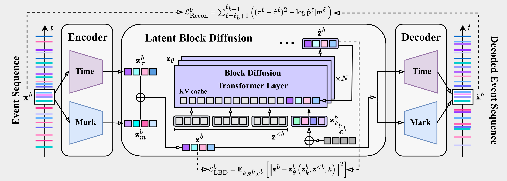
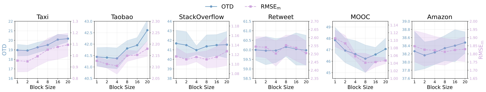
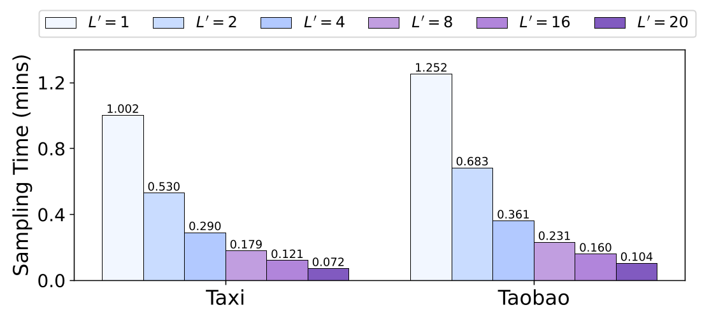
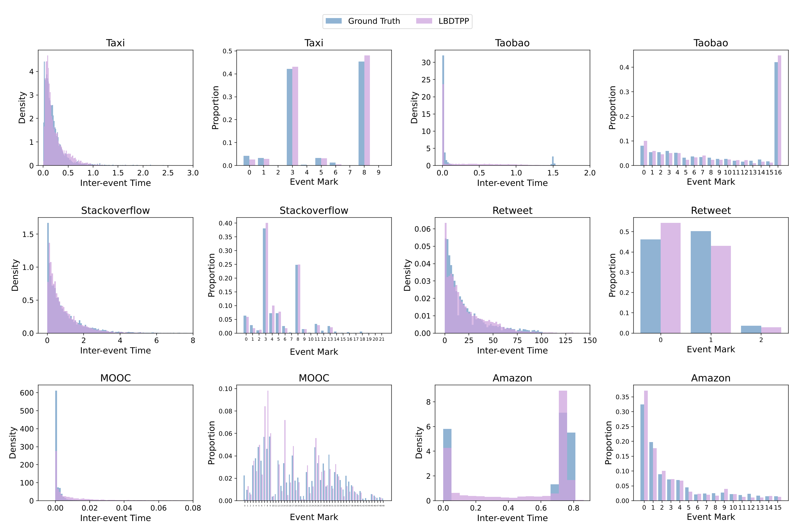
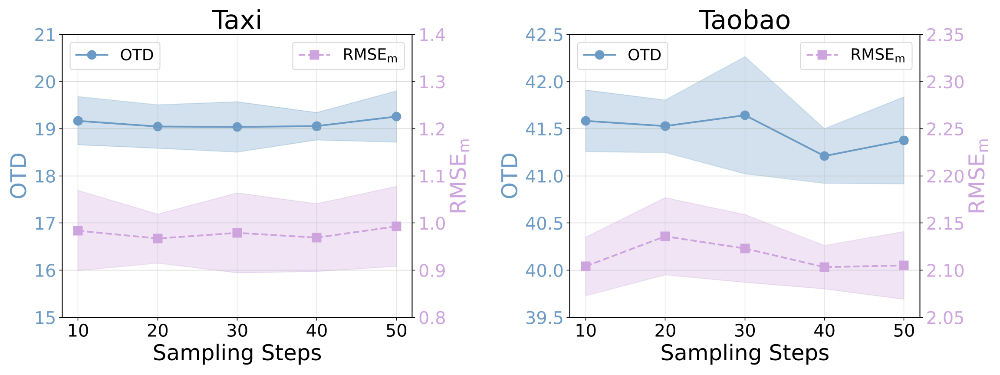
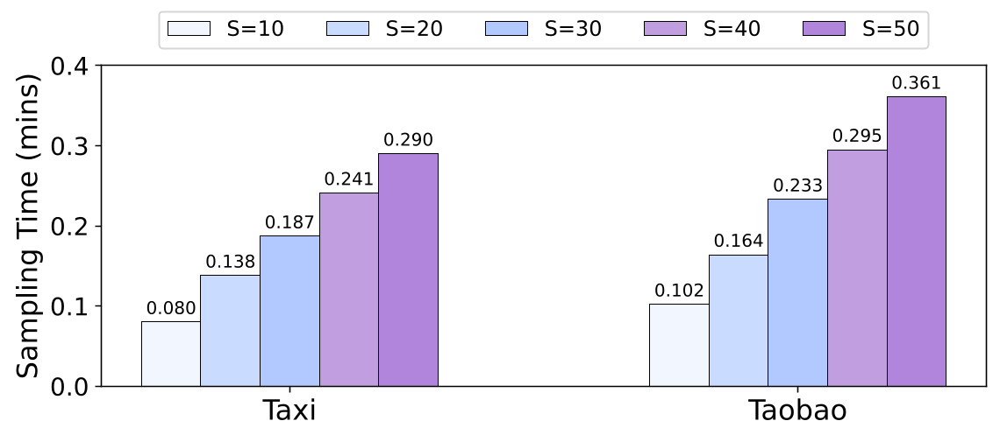
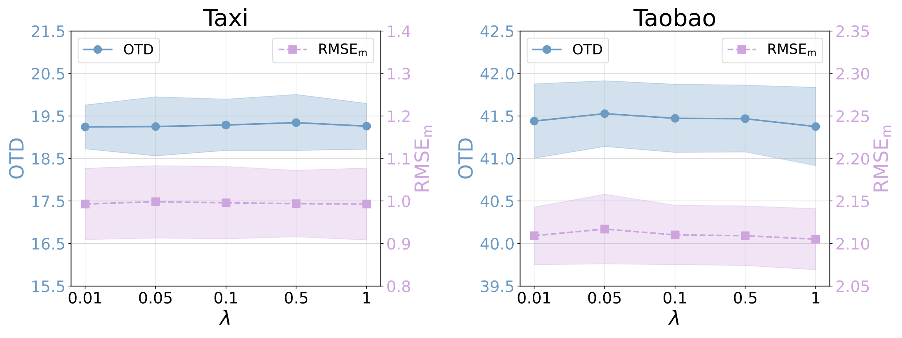
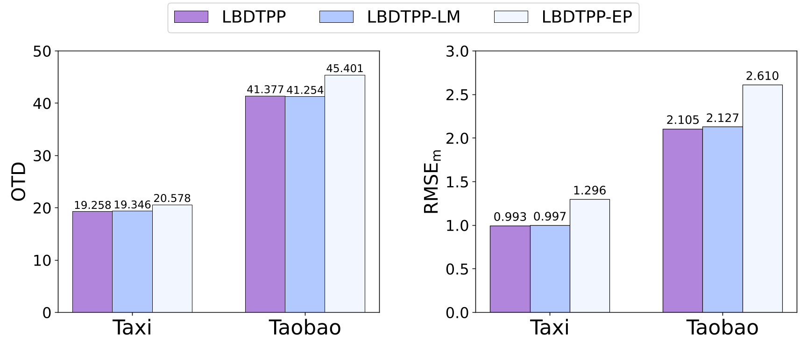
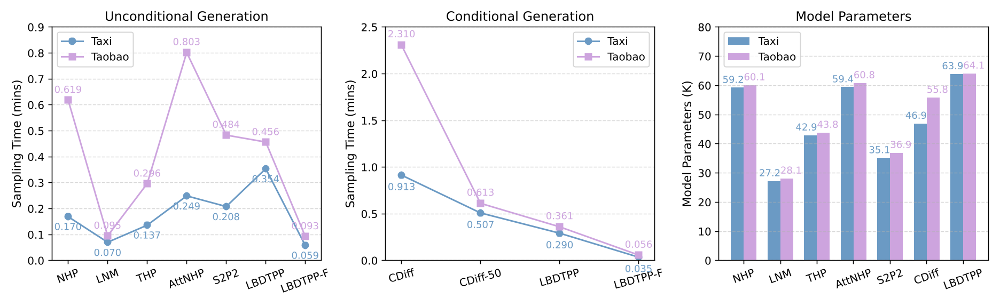

# Latent Block-Diffusion Temporal Point Processes

Pytorch implementation of the paper **"Latent Block-Diffusion Temporal Point Processes: A Semi-Autoregressive Framework for Asynchronous Event Sequence Generation"**.

> Paper: [arXiv:2606.24982](https://arxiv.org/abs/2606.24982)  

## Overview

Latent Block-Diffusion Temporal Point Processes (LBDTPP) is a semi-autoregressive framework for asynchronous event sequence generation. It models event sequences at two levels:

- **Across blocks:** event blocks are generated autoregressively, preserving temporal dependencies and supporting variable-length generation.
- **Within each block:** multiple event representations are sampled in parallel through Gaussian diffusion in a continuous latent space, reducing event-by-event error accumulation.

This design combines the length flexibility of autoregressive TPPs with the high-quality parallel generation capability of diffusion models.

## Framework

<p align="center">
  
</p>

The model first embeds each marked event sequence into a continuous latent space. A block diffusion Transformer then learns the latent distribution by autoregressively modeling event blocks and denoising each block through Gaussian diffusion. Finally, the decoded latent representations reconstruct timestamps and marks in the event space.

## Core Formulation

Each event $\mathbf{x}^{\ell}=(\tau^{\ell}, m^{\ell})$ is encoded into a latent representation by combining time and mark embeddings:

$$
\mathbf{z}^{\ell}=\mathrm{TimeEmbed}(\tau^{\ell})+\mathbf{W}\cdot\mathrm{OneHot}(m^{\ell})
$$

The latent sequence $\mathbf{z}=(\mathbf{z}^{1},\ldots,\mathbf{z}^{L})$ is partitioned into $B=L/L'$ blocks. LBDTPP factorizes the latent distribution autoregressively across blocks and performs Gaussian diffusion within each block:

$$
\log p_{\boldsymbol{\theta}}(\mathbf{z})=\sum_{b=1}^{B}\log p_{\boldsymbol{\theta}}\left(\mathbf{z}^{b}\mid\mathbf{z}^{1:b-1}\right)
$$

For block $b$, the forward diffusion process is defined as:

$$
q(\mathbf{z}_k^{b}\mid\mathbf{z}_0^{b})=\mathcal{N}\!\left(\mathbf{z}_k^{b};\sqrt{\bar{\alpha}_k}\mathbf{z}_0^{b},\,(1-\bar{\alpha}_k)\mathbf{I}\right),
\quad
\mathbf{z}_k^{b}=\sqrt{\bar{\alpha}_k}\mathbf{z}_0^{b}+\sqrt{1-\bar{\alpha}_k}\boldsymbol{\epsilon}^{b}
$$

The latent block diffusion loss is:

$$
\mathcal{L}_{\mathrm{LBD}}(\mathbf{z};\boldsymbol{\theta})
=\frac{1}{L}\sum_{b=1}^{B}\mathbb{E}_{k,\mathbf{z}^{b},\boldsymbol{\epsilon}^{b}}
\left[\left\|\mathbf{z}^{b}-\mathbf{z}_{\boldsymbol{\theta}}^{b}\left(\mathbf{z}_k^{b},\mathbf{z}^{1:b-1},k\right)\right\|^{2}\right]
$$

Events are decoded from latent representations via two MLPs. The reconstruction loss combines inter-event time MSE and mark cross-entropy:

$$
\mathcal{L}_{\mathrm{Recon}}(\mathbf{x},\hat{\mathbf{x}};\boldsymbol{\phi})
=\frac{1}{L}\sum_{\ell=1}^{L}\left[\left(\tau^{\ell}-\hat{\tau}^{\ell}\right)^{2}-\log\hat{\mathbf{p}}^{\ell}[m^{\ell}]\right]
$$

The model is trained end-to-end by minimizing:

$$
\mathcal{L}_{\mathrm{Overall}}(\mathbf{x};\boldsymbol{\theta},\boldsymbol{\phi})
=\mathcal{L}_{\mathrm{LBD}}+\lambda\mathcal{L}_{\mathrm{Recon}}
$$

## Algorithms

### Algorithm 1: LBDTPP Training

```
Input: event sequence x of length L, block size L', diffusion steps K

repeat
  1. z ← Encoder(x);  x̂ ← Decoder(z)
  2. Sample k1, ..., kB ~ Uniform({1, ..., K})          ▷ B = L / L'
  3. For each b ∈ {1, ..., B}:
       z_{k_b}^b ~ q(· | z^b)                           ▷ forward diffusion
  4. ∅, K^{1:B}, V^{1:B} ← z_θ(z)                       ▷ KV cache
  5. For each b:
       ẑ^b, ∅, ∅ ← z_θ^b(z_{k_b}^b, K^{1:b-1}, V^{1:b-1}, k_b)
  6. ẑ ← ẑ^1 ⊕ ··· ⊕ ẑ^B
  7. Take gradient descent step on ∇_{θ,φ} L_Overall(x; θ, φ)
until converged
```

### Algorithm 2: LBDTPP Sampling

```
Input: model z_θ, generation interval [0, T]

x, K, V ← ∅;  b ← 1;  ℓ_b ← 0;  t^{ℓ_b} ← 0

while t^{ℓ_b} < T do
  1. z^b ← SAMPLE(z_θ^b, K^{1:b-1}, V^{1:b-1})          ▷ len(z^b) = L'
  2. ∅, K^b, V^b ← z_θ^b(z^b)                           ▷ KV cache
  3. (K, V) ← (K^{1:b-1} ⊕ K^b, V^{1:b-1} ⊕ V^b)
  4. x^b ← Decoder(z^b)
  5. x ← x^{1:b-1} ⊕ x^b
  6. ℓ_{b+1} ← ℓ_b + L';  t^{ℓ_{b+1}} ← t^{ℓ_b} + Σ_i τ^{ℓ_b+i}
  7. b ← b + 1
end while

return truncate(x, T)                                    ▷ truncate at time T
```

At inference time, `SAMPLE` can be implemented with DDPM or DDIM. Blocks are generated sequentially, while events within each block are sampled in parallel through diffusion.

## Main Results

All metrics are lower-is-better. Results are reported as mean ± standard deviation in the paper.

### Unconditional Generation

The table summarizes Table II from the paper by comparing LBDTPP with the strongest baseline on each dataset/metric.

<table>
  <thead>
    <tr>
      <th>Dataset</th>
      <th>Metric</th>
      <th>Best baseline</th>
      <th>LBDTPP</th>
    </tr>
  </thead>
  <tbody>
    <tr>
      <td rowspan="2">Taxi</td>
      <td>OTD</td>
      <td>58.004 ± 0.127</td>
      <td><strong>39.458 ± 0.843</strong></td>
    </tr>
    <tr>
      <td>RMSE_m</td>
      <td>5.499 ± 0.030</td>
      <td><strong>2.985 ± 0.196</strong></td>
    </tr>
    <tr>
      <td rowspan="2">Taobao</td>
      <td>OTD</td>
      <td>104.277 ± 0.388</td>
      <td><strong>98.965 ± 0.608</strong></td>
    </tr>
    <tr>
      <td>RMSE_m</td>
      <td>7.329 ± 0.018</td>
      <td><strong>7.192 ± 0.069</strong></td>
    </tr>
    <tr>
      <td rowspan="2">StackOverflow</td>
      <td>OTD</td>
      <td>140.620 ± 0.510</td>
      <td><strong>128.427 ± 0.981</strong></td>
    </tr>
    <tr>
      <td>RMSE_m</td>
      <td>5.579 ± 0.050</td>
      <td><strong>5.007 ± 0.081</strong></td>
    </tr>
    <tr>
      <td rowspan="2">Retweet</td>
      <td>OTD</td>
      <td>96.343 ± 0.233</td>
      <td><strong>95.790 ± 0.754</strong></td>
    </tr>
    <tr>
      <td>RMSE_m</td>
      <td>20.575 ± 0.057</td>
      <td><strong>20.402 ± 0.252</strong></td>
    </tr>
    <tr>
      <td rowspan="2">MOOC</td>
      <td>OTD</td>
      <td>72.895 ± 0.215</td>
      <td><strong>64.943 ± 0.266</strong></td>
    </tr>
    <tr>
      <td>RMSE_m</td>
      <td>1.480 ± 0.003</td>
      <td><strong>1.407 ± 0.007</strong></td>
    </tr>
    <tr>
      <td rowspan="2">Amazon</td>
      <td>OTD</td>
      <td>87.238 ± 0.133</td>
      <td><strong>80.914 ± 0.564</strong></td>
    </tr>
    <tr>
      <td>RMSE_m</td>
      <td>5.219 ± 0.026</td>
      <td><strong>5.008 ± 0.007</strong></td>
    </tr>
  </tbody>
</table>

### Conditional Generation

The paper reports that LBDTPP achieves the best OTD and RMSE_m on 5/6 datasets, the best RMSE_tau on 6/6 datasets, and the best sMAPE on 4/6 datasets. The LBDTPP scores from Table III are:

| Dataset | OTD | RMSE_m | RMSE_tau | sMAPE |
| --- | --- | --- | --- | --- |
| Taxi | 19.258 ± 0.541 | 0.993 ± 0.085 | 0.270 ± 0.003 | 74.171 ± 0.723 |
| Taobao | 41.377 ± 0.460 | 2.105 ± 0.036 | 0.407 ± 0.011 | 158.514 ± 0.841 |
| StackOverflow | 40.969 ± 0.452 | 1.115 ± 0.010 | 1.070 ± 0.015 | 90.975 ± 0.155 |
| Retweet | 59.963 ± 0.632 | 2.503 ± 0.078 | 22.520 ± 0.305 | 89.209 ± 0.913 |
| MOOC | 46.633 ± 1.178 | 1.058 ± 0.009 | 0.262 ± 0.027 | 167.809 ± 2.039 |
| Amazon | 38.237 ± 0.297 | 1.822 ± 0.086 | 0.352 ± 0.019 | 77.285 ± 1.744 |

## Experimental Analysis

### Block Size

LBDTPP benefits from block-wise generation: moderate block sizes improve generation quality, while larger blocks reduce sampling time.

<p align="center">
  
</p>

<p align="center">
  
</p>

### Distribution Evaluation

The generated inter-event time and mark distributions closely match the ground-truth distributions, showing that LBDTPP captures both temporal and categorical patterns.

<p align="center">
  
</p>

### Sampling Steps

LBDTPP remains stable with fewer DDIM sampling steps, enabling a practical trade-off between generation quality and efficiency.

<p align="center">
  
</p>

<p align="center">
  
</p>

### Loss Weight Sensitivity

The model is robust to the reconstruction loss weight `lambda`, maintaining strong performance across different values.

<p align="center">
  
</p>

### Model Variants

The model variant study validates the default design choices, including the fixed event encoder and clean latent block prediction.

<p align="center">
  
</p>

### Sampling Time Comparison

LBDTPP achieves competitive sampling efficiency, and the fast variant further reduces sampling time.

<p align="center">
  
</p>

## Installation
1. Install the dependencies
```
conda create --name bdtpp python=3.10
conda activate bdtpp
pip install -r requirements.txt
```
2. Unzip the data
```
unzip data.zip
```

## Dataset
The six real-world datasets are from [CDiff](https://github.com/networkslab/cdiff).

## Running Experiments
We provide runnable experiment scripts:
- `exp_conditional.sh`: commands for conditional generation
- `exp_unconditional.sh`: commands for unconditional generation

## Citation

If you find this repository useful, please cite:

```bibtex
@article{zhang2026latent,
  title={Latent Block-Diffusion Temporal Point Processes: A Semi-Autoregressive Framework for Asynchronous Event Sequence Generation},
  author={Zhang, Shuai and Chen, Yancheng and Zhou, Chuan and Liu, Yang and Lin, Xixun and Zhao, Xiangyu and Zhu, Jun and Ma, Zhi-Ming},
  journal={arXiv preprint arXiv:2606.24982},
  year={2026}
}
```
